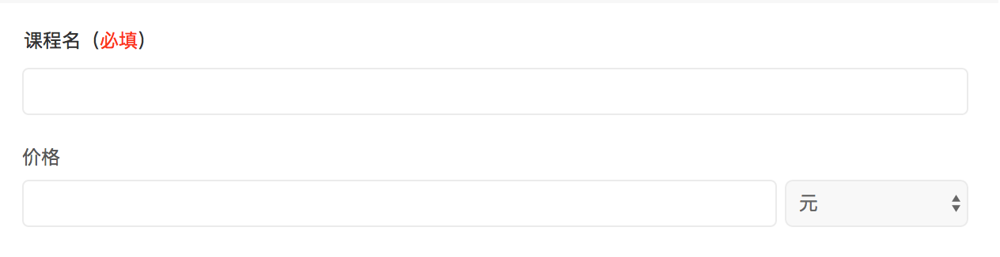
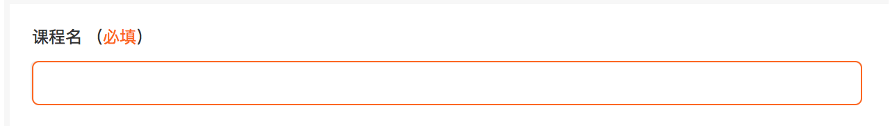

# 表单必填项处理规范

## 定义

- 必填项存在于表单之中
- 必填项为input
- 必填项输入格式必须是规定格式
- 必填项不能为空

## 事件

- 表单初始化（用户未操作的时候）
- 光标移出 input
- 提交表单

## 场景

- 浮层表单
	- 当表单中存在必填项填写不符合规定时，禁用提交按钮（仅适用于浮层）
		当必填项未填写或格式不是规定格式时，提交按钮处于禁用状态。表单默认提交按钮状态为禁用状态

- 非浮层表单
	- 非浮层表单提交按钮一直为可用状态

## 视觉反馈

- 必填项 label 的标注
	
	1. 必填项以 **（必填）** 文字体现，如图：课程名为必填项，价格为选填项
	2. **（必填）** 文本中  *必填*  颜色 `#ff6600` ，位置跟随必填项文案之后

- 必填项未填写或格式不正确时，
	1. 填写表单时，当光标移出填写框后若不符合必填项格式规范则填写框颜色发生改变
		
		填写框边框颜色变化为 `#ff6600`
	2. 通过修改必填格式，若填写格式正确时，光标移出后判定格式正确，则填写框颜色恢复默认颜色

- 表单提交失败时，点击提交按钮对表单所有填写项做格式检查，格式检查错误的填写框颜色变化为`#ff6600`，并 Toast 提示表单提交失败。
